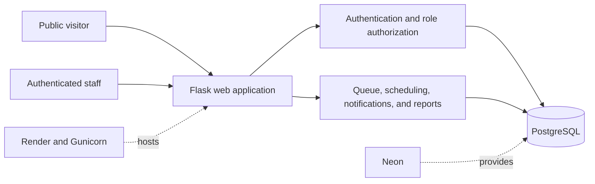

# Smart Class Management System

The Smart Class Management System (SCMS) is a Flask web application for requesting, approving, scheduling, and publishing Smart Class use. It gives school staff a controlled workflow while exposing only the current approved daily schedule to public visitors.

- Live application: [smart-class-management-system.onrender.com](https://smart-class-management-system.onrender.com/)
- Repository: [github.com/INEZA-24/Smartclass](https://github.com/INEZA-24/Smartclass)

## Problem being solved

Shared Smart Class rooms need a reliable booking process. SCMS replaces informal requests and manual conflict checking with a priority queue, controlled approval, conflict-safe scheduling, in-app notifications, reports, and a privacy-limited public timetable.

## Main workflow

1. A Teacher submits a high-priority request for a class, or a Class Monitor submits a normal-priority request for the class assigned to that account.
2. Requesters provide a subject and private reason but do not select a date, prep, or room.
3. The Patron/Matron reviews the pending queue and either rejects a request or schedules it into an available slot in the rolling three-day window.
4. The application checks active resources, blocks, and room, class, and teacher conflicts in one transaction.
5. The requester receives an in-app notification. Approved bookings appear in authorized views and, on their scheduled date, in the privacy-safe public schedule.
6. The Administrator or Patron/Matron may later reschedule or cancel an existing scheduled booking.

## Key features

- Role-based authentication and forced temporary-password changes
- Teacher-first pending request queue with a 12-request limit and 9-request reopen threshold
- Rolling three-day schedule builder using the `Africa/Kigali` timezone
- Slot, room-day, and full-day availability blocks
- Transactional conflict prevention and PostgreSQL advisory locking
- Rescheduling, rejection, and cancellation with preserved history
- In-app notifications and append-oriented audit records
- Public current-day schedule with private request data excluded
- Daily, weekly, history, room-usage, and class-usage reports
- Responsive Bootstrap interface and custom error pages

## User roles

- **Administrator:** manages users, classes, and rooms; views reports and audit logs; blocks availability; and reschedules or cancels existing bookings. An Administrator cannot initially approve a pending request.
- **Patron/Matron:** the user-facing label for the internal `SCHEDULER` role. This is the only role that initially approves and schedules pending requests. It may also reject, block, unblock, reschedule, cancel, and view reports.
- **Teacher:** submits high-priority requests, manages them while pending, and receives notifications.
- **Class Monitor:** submits normal-priority requests for the class assigned to the account, selects a responsible Teacher, manages requests while pending, and receives notifications.
- **Public visitor:** needs no account and can view only today's approved schedule. Public access does not include private dashboards.

## Technology stack

- Python and Flask application factory
- Jinja2 and Bootstrap 5
- SQLAlchemy and Flask-Migrate/Alembic
- Flask-Login and Flask-WTF with CSRF protection
- PostgreSQL in production and SQLite for automated tests and limited local development
- Gunicorn application server
- Render web hosting and Neon PostgreSQL
- pytest, Ruff, and Bandit for verification

## High-level architecture



See the [architecture summary](project-docs/ARCHITECTURE_SUMMARY.md) for component and deployment details.

## Scheduling and conflict-prevention rules

- The planning window is the current `Africa/Kigali` date plus the next two calendar dates and rolls at midnight.
- Same-day scheduling and rescheduling are allowed. Weekends and holidays are not automatically excluded; an authorized user can block an unavailable day.
- A slot is Available, Booked, or Unavailable.
- The same room, class, or Teacher cannot be booked twice for the same date and prep.
- Scheduling cannot use an inactive room, class, or Teacher, or a slot covered by an active block.
- A block cannot cover an active booking and never silently cancels or overwrites one.
- Scheduling, rescheduling, scheduled cancellation, block creation, and block removal share deterministic PostgreSQL transaction-level advisory locks keyed by schedule date.
- Partial unique indexes on active room, class, and teacher slots provide the final booking-to-booking conflict defense.

## Security controls

- Secure password hashing; plain-text passwords are not stored or logged
- Generic login failures and disabled-account protection
- Forced password change for temporary passwords
- Server-side role authorization for protected actions
- CSRF protection for state-changing forms
- SQLAlchemy parameterized database access and Jinja auto-escaping
- Secure production cookies and trusted-proxy configuration
- Secrets supplied through environment variables, not source control
- Privacy-limited public pages, notifications, audit details, and logs
- Generic production error pages without stack traces or internal details

## Local development setup

The repository pins Python 3.14.2 in `.python-version`, and Python 3.14.2 should be used for a reproducible setup. Support is not claimed for untested Python versions. PostgreSQL is the intended database engine; SQLite is used by the automated test configuration. The `tzdata` dependency ensures that `Africa/Kigali` can be loaded on Windows.

```bash
python -m venv .venv
```

Activate the virtual environment for your shell, then run:

```bash
python -m pip install -r requirements.txt
python -m pip install -r requirements-dev.txt
```

Copy `.env.example` to a local `.env`, provide development-only values, and never commit that file. Required or supported environment-variable names are:

- `APP_ENV`
- `SECRET_KEY`
- `DATABASE_URL`
- `INITIAL_ADMIN_USERNAME` (optional, one-time deployment bootstrap)
- `INITIAL_ADMIN_FULL_NAME` (optional, one-time deployment bootstrap)
- `INITIAL_ADMIN_PASSWORD` (optional, one-time deployment bootstrap)

For ordinary local startup, leave all three `INITIAL_ADMIN_*` variables unset. Start Flask with:

```bash
flask --app wsgi:app run
```

## Database migrations and seed data

Apply reviewed migrations and then run the idempotent seed command:

```bash
flask --app wsgi:app db upgrade
flask --app wsgi:app seed
```

The seed command ensures the approved class list, Smart Class 1 through 3, and the singleton system-settings row exist. It does not create a default Administrator or operational booking data.

## Testing

```bash
python -m compileall app tests scripts
python -m ruff check .
python -m pytest
python -m bandit -r app
python -m pip check
python scripts/secret_scan.py
```

After deployment, the credential-free smoke test can check the public application surface:

```bash
python scripts/smoke_test.py --base-url https://your-deployment.example
```

## Production deployment

The demonstration architecture uses a Render Python web service running Gunicorn and a direct TLS connection to Neon PostgreSQL. Startup validates configuration, applies reviewed migrations, runs the idempotent seed and optional one-time Administrator provisioning commands, removes bootstrap variables, and then starts Gunicorn. Render calls the database-independent `/health` endpoint. The live demonstration passed the credential-free, non-mutating deployment smoke test. See the [deployment runbook](project-docs/DEPLOYMENT.md) for safeguards and the documented manual verification process.

## Documentation

- [Software requirements](project-docs/SRS.md)
- [Architecture summary](project-docs/ARCHITECTURE_SUMMARY.md)
- [Database specification](project-docs/DATABASE.md)
- [Entity-relationship diagram](project-docs/ERD.md)
- [User-interface flow](project-docs/UI_FLOW.md)
- [Development plan](project-docs/DEVELOPMENT_PLAN.md)
- [Deployment runbook](project-docs/DEPLOYMENT.md)
- [Demo guide](project-docs/DEMO_GUIDE.md)
- [Known limitations](project-docs/KNOWN_LIMITATIONS.md)
- [Demo video plan](project-docs/DEMO_VIDEO_PLAN.md)
- [Screenshot checklist](project-docs/SCREENSHOT_CHECKLIST.md)

## Screenshots

Privacy-reviewed screenshots are planned for Milestone 12B. The future files will be stored under `docs/screenshots/` after approval. No placeholder images or broken image links are included here. See the [screenshot checklist](project-docs/SCREENSHOT_CHECKLIST.md).

## Known limitations

Version 1 does not provide attendance, marks or grading, student accounts, email or SMS messages, AI-generated schedules, calendar integration, or PDF exports. The free demonstration deployment has cold-start and resource limitations and is not automatically approved for operational school data. See [known limitations](project-docs/KNOWN_LIMITATIONS.md) for the full operational and data-governance context.

## License

This project is licensed under the [MIT License](LICENSE).

## Author

INEZA Fidele
