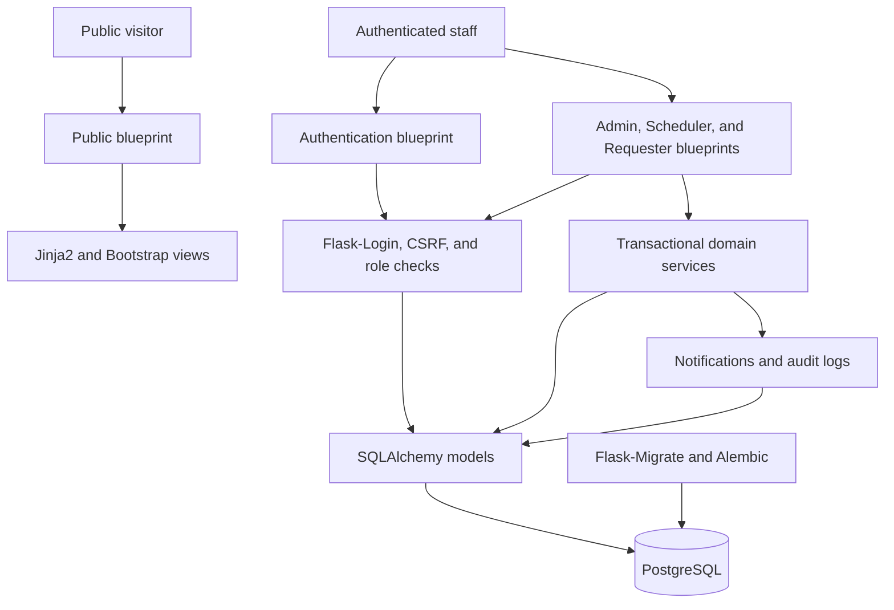
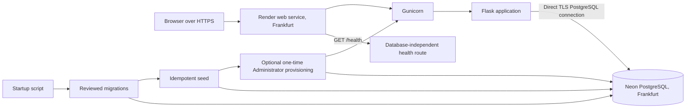

# Architecture Summary

## System context

The Smart Class Management System is a server-rendered web application for managing requests and schedules for shared Smart Class rooms. Public visitors can view only the approved schedule for the current `Africa/Kigali` date. Authenticated staff use role-specific workflows for requests, scheduling, administration, notifications, and reports.

The application is the authority for queue state and schedule changes. PostgreSQL persists users, requests, bookings, blocks, notifications, audit records, and singleton system settings.

## Main components

- **Public interface:** current-day schedule, login entry point, health response, and public error pages.
- **Authentication and authorization:** login, logout, temporary-password change, user loading, CSRF protection, and reusable server-side role checks.
- **Requester interface:** Teacher and Class Monitor request submission, pending edits and cancellation, history, and notifications.
- **Scheduler interface:** priority queue, initial scheduling, rejection, three-day schedule builder, blocks, rescheduling, and cancellation.
- **Administration interface:** user, class, and room management; existing-schedule changes; reports; and audit-log access.
- **Service layer:** transactional queue, scheduling, blocking, notification, reporting, and audit operations.
- **Persistence layer:** SQLAlchemy models backed by PostgreSQL, with Alembic migrations managed through Flask-Migrate.
- **Presentation layer:** Jinja2 templates and Bootstrap 5 for responsive server-rendered pages.

## Request flow

1. Flask receives an HTTP request through the application factory and selected blueprint.
2. Authentication, forced-password-change, CSRF, and role checks run before protected actions.
3. Flask-WTF validates submitted form data.
4. The route invokes the relevant transactional service.
5. The service locks and refreshes required rows, validates current state, and performs the mutation atomically.
6. Successful business actions create the required notification and audit record in the same transaction.
7. The route renders a Jinja2 response or redirects to the appropriate role view.

## Authentication and authorization

Passwords are stored only as Werkzeug-compatible hashes. Flask-Login manages authenticated sessions and loads users from the database. Disabled users cannot authenticate or remain authorized. Users with temporary passwords are restricted to changing the password, logging out, and required static resources until the flag is cleared.

Authorization is enforced on the server. The internal roles are `ADMIN`, `SCHEDULER`, `TEACHER`, and `MONITOR`; `SCHEDULER` is displayed as Patron/Matron. A wrong authenticated role receives HTTP 403. Only the Patron/Matron can initially schedule a Pending request, while the Administrator and Patron/Matron can change an existing Scheduled booking.

## Database and migrations

The domain is stored in the User, SchoolClass, Room, BookingRequest, ScheduledBooking, RoomBlock, Notification, AuditLog, and SystemSettings tables described in the [database specification](DATABASE.md). Database timestamps are timezone-aware; application dates use `Africa/Kigali`.

Flask-Migrate and Alembic apply reviewed schema changes. Startup upgrades the database but never generates migrations, downgrades, resets tables, or depends on production data. The seed command is idempotent and ensures only approved reference data and the singleton settings row.

## Queue control

SystemSettings stores the maximum pending count of 12, reopen threshold of 9, and persistent queue-lock state. Request submission locks and refreshes the singleton row with `SELECT FOR UPDATE`, counts Pending requests, and either rejects the submission or inserts it. Reaching 12 locks the queue. Once locked, it remains locked at 10 or 11 and reopens only when a transactional status change reduces the count to 9 or fewer.

Queue order is Teacher requests first, Class Monitor requests second, and oldest first inside each priority group.

## Scheduling conflict prevention

Before scheduling or rescheduling, the application verifies the planning date, active room, active class, active Teacher, room blocks, and existing bookings. It prevents duplicate use of the same room, class, or Teacher for the same date and prep. A new block is rejected if its slot, room-day, or full-day scope contains an active booking.

Application checks are reinforced by PostgreSQL partial unique indexes for active room, class, and teacher slots. No block silently overwrites or cancels an existing booking.

## PostgreSQL advisory locking

Bookings and room blocks reside in separate tables, so unique indexes alone cannot serialize a concurrent booking and block. Scheduling, rescheduling, scheduled cancellation, block creation, and block removal therefore acquire the same deterministic PostgreSQL transaction-level advisory lock for every affected schedule date before checking bookings, blocks, or conflicts.

Multi-date operations acquire locks in chronological order. PostgreSQL releases the locks on commit or rollback. This cross-table protocol works with the booking unique indexes as a layered conflict defense.

## Notification and audit-log flow

Approval, rejection, rescheduling, cancellation, and password reset can create in-app notifications for the affected user. Notifications have read and unread state and may refer to a booking request. They do not expose the private booking reason unnecessarily.

Important mutations also append an audit entry containing the actor, action, entity, timestamp, and deliberately limited structured details. The business change, notification, and audit entry are committed together so a failed transaction does not leave a misleading success record.

## Render and Neon production architecture

Render builds the Python service, runs the fail-fast startup script, and starts Gunicorn. The application connects directly to Neon PostgreSQL over TLS rather than through a pooler because transaction-level advisory-lock semantics must remain predictable. Render terminates public HTTPS and checks the database-independent `/health` endpoint.

Startup order is migration, seed, optional one-time Administrator provisioning, removal of the bootstrap variables, and Gunicorn. Configuration and credentials remain in the Render environment and are not stored in the repository.

## Security boundaries

- The public boundary exposes only the current daily timetable, login page, health response, and safe error pages.
- The session boundary requires authentication, fresh active-account state, and completion of any forced password change.
- The authorization boundary checks the exact role for every protected action rather than relying on navigation visibility.
- The form boundary uses CSRF protection and server-side validation.
- The transaction boundary locks fresh database state and commits the domain change, notification, and audit together.
- The data boundary keeps private reasons and internal details out of public pages, generic errors, logs, and unnecessary notification or audit content.
- The deployment boundary requires secure environment configuration, TLS, secure cookies, a constrained proxy trust setting, and no debug output.

## Component diagram

## Deployment diagram

