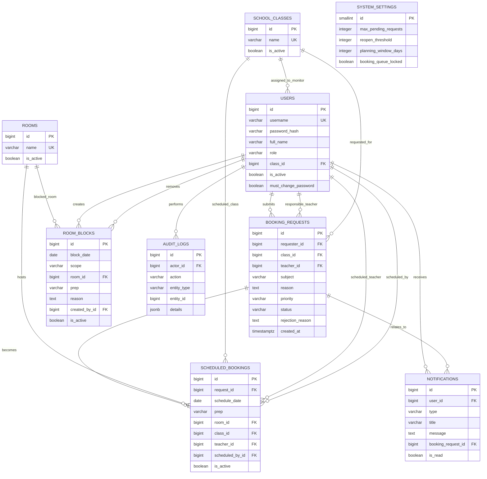

# Entity-Relationship Diagram

## Role and scheduling constraints

- `USERS.role` is one of `ADMIN`, `SCHEDULER`, `TEACHER`, or `MONITOR`.
- `SCHEDULER` is displayed to users as Patron/Matron.
- Only `SCHEDULER` may initially approve and schedule a Pending request.
- `ADMIN` and `SCHEDULER` may reschedule or cancel an existing Scheduled booking.
- All application date calculations use `Africa/Kigali`; database timestamps remain timezone-aware.
- A room block must not overlap an active Scheduled booking within its slot, room-day, or day scope.
- Scheduled-booking and room-block mutations affecting a date share one deterministic PostgreSQL transaction-level advisory lock for that date. This cross-table lock is acquired before conflict checks; booking partial unique indexes remain the final booking-conflict defense.
